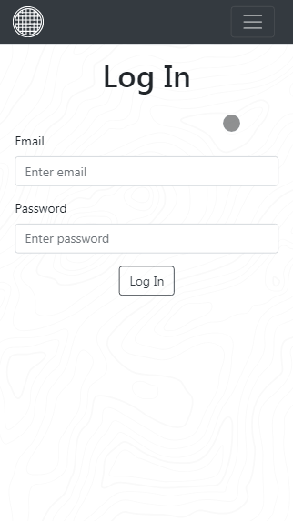

<h1 align="center">Without Water</h1>

 

> Without Water is an implementation of the task https://github.com/maxfarseer/tz-webinars/tree/tz-2-react-redux-router-async.

  
      
  

 

  

 

## Description

Without Water is a project based on the set of instructions, that you can found here https://github.com/maxfarseer/tz-webinars/tree/tz-2-react-redux-router-async (in russian). The goal of the task is to show skills of React, Redux, React Router, asynchronous queries, understanding the interaction between the client and the server.

BackEnd server is already set up. <strong>Credentials:</strong> `email = 'max@test.com', password = '12345'`.

## Demo

To see the project online click that link <a href="https://mlobunko.github.io/without-water/">DEMO</a>

## Installation

Open Git Bash.

Change the current working directory to the location where you want the cloned directory to be made.

Clone repository:

`git clone https://github.com/mlobunko/without-water.git`

Install:

`npm install` or `yarn install`

## Development

Runs the app in development mode:

`npm start` or `yarn start`

Runs the test watcher in an interactive mode:

`npm test` or `yarn test`

## Built With

- [React](https://github.com/facebook/react) - A JavaScript library for building user interfaces
- [Redux](https://github.com/reduxjs/redux) - Predictable state container for JavaScript apps
- [React Router](https://github.com/ReactTraining/react-router) - Declarative routing for React
- [Redux-Saga](https://github.com/redux-saga/redux-saga) - An alternative side effect model for Redux apps
- [Reselect](https://github.com/reduxjs/reselect) - Selector library for Redux
- [prop-types](https://github.com/facebook/prop-types) - Runtime type checking for React props
- [Jest](https://github.com/facebook/jest) - JavaScript Testing
- [Enzyme](https://github.com/airbnb/enzyme) - JavaScript Testing utilities for React
- [Redux Saga Test Plan](https://github.com/jfairbank/redux-saga-test-plan) - Test Redux Saga
- [Styled Components](https://github.com/styled-components/styled-components) - Visual primitives for the components
- [Bootstrap](https://github.com/twbs/bootstrap) - Front-end framework
- [Reactstrap](https://github.com/reactstrap/reactstrap) - Stateless React Components for Bootstrap 4
- [react-fontawesome](https://github.com/FortAwesome/react-fontawesome) - Font Awesome 5 React component
- [Prettier](https://github.com/prettier/prettier) - Opinionated code formatter

## License

This project is licensed under the MIT License - see the [LICENSE.md](LICENSE.md) file for details

## Acknowledgments

- [Flaticon](https://www.flaticon.com/) - Logo image
- [Hero Patterns](http://www.heropatterns.com/) - Background image
